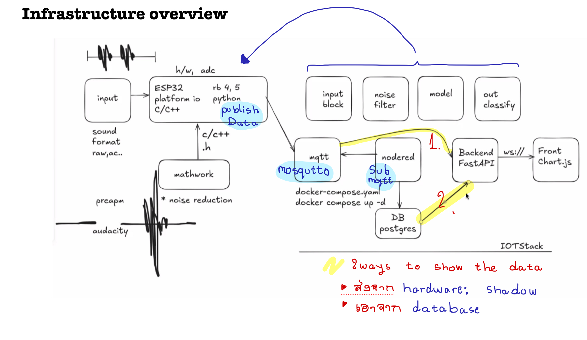

# Pakkaphan Permvanitkul TGR2024 Progress Book

## Server-Site overviews

### Components (Thanks to P'luk mhee for the overview guideline)
#### Fast-Api (Back-end) 
`Uvicorn` - Uvicorn is an ASGI-compliant, lightning-fast web server that runs your FastAPI application. It acts as the interface between the ASGI framework (FastAPI) and the client (browser, API client, etc.).  
`ASGI (Asynchronous Server Gateway Interface)` - allows applications like FastAPI to handle both synchronous and asynchronous operations, meaning you can handle long-running tasks like WebSockets, background tasks, and other I/O-bound operations without blocking other requests.  

#### Chart.js (Front-end via ws://) 

#### Database 
   

## Docker-compose.yml

    mkdocs.yml    # The configuration file.
    docs/
        index.md  # The documentation homepage.
        ...       # Other markdown pages, images and other files.
